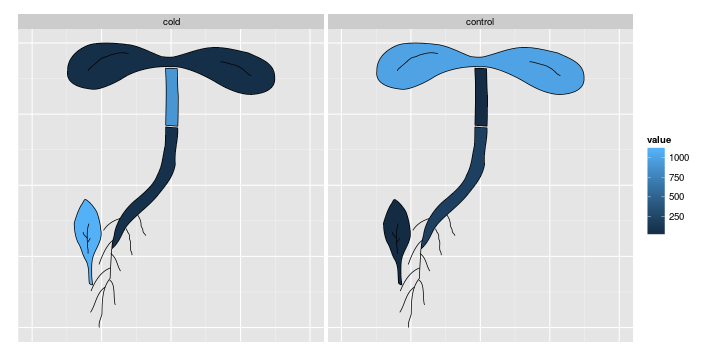
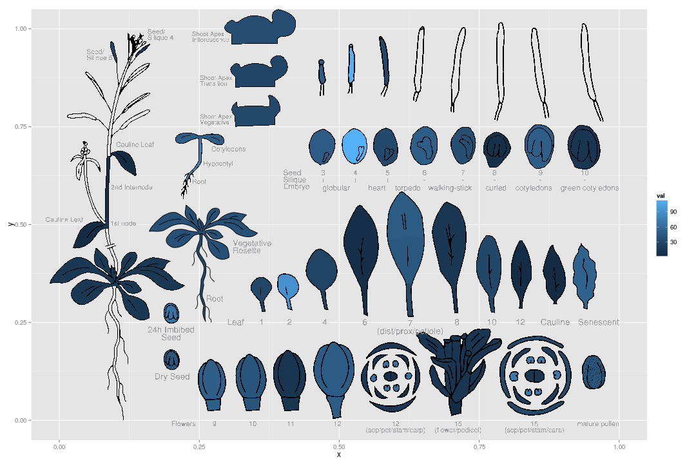

ggefp
=====

ggefp is an extension of the ggplot2 package that provides
functionality to plot line drawings with regions filled according to
provided data. With the right line drawings, ggefp can be used to
provide data visualization similar to those known from the [eFP
browser](http://bar.utoronto.ca/efp/cgi-bin/efpWeb.cgi) that shows
gene expression values in various tissues in plants and other species.

To install or update, run:
   
    library(devtools)
    install_github("hredestig/ggefp", subdir="pkg")

Usage
-----

The line drawings to display are denoted *exhibits* and define the
line drawing as well as which paths correspond to which tissue. To see
the exhibits bundled with the package (currently the main Arabidopsis
developmental map kindly provided by Nicholas Provart)


```r
library(ggefp)
head(exhibits())
```

```
##             exhibit       tissue  from
## 1 ath_dormant_seeds imbibed-seed ggefp
## 2 ath_dormant_seeds     dry-seed ggefp
## 3 ath_flower_series        bud-9 ggefp
## 4 ath_flower_series       bud-10 ggefp
## 5 ath_flower_series       bud-11 ggefp
## 6 ath_flower_series       bud-12 ggefp
```


We can define a combination of exhibits to use to a *collection* by
specifiying the names of the exhibits and where to plot them.


```r
collection <- data.frame(exhibit = c("ath_seedling", "ath_young_plant"), x = c(0.2, 
    0.7), y = c(0.5, 0.5), width = c(0.4, 0.6), height = c(1, 1))
```


we can then define some data and generate the plot


```r
values <- data.frame(tissue = rep(c("hypocotyl-root", "cotelydons", "vegetative-rosette", 
    "root"), 2), value = c(1, 200, 20, 1100, 1, 40, 60, 900), treatment = rep(c("control", 
    "cold"), each = 4))

ggplot(values, aes(tissue = tissue, fill = value)) + geom_efp(collection) + 
    facet_wrap(~treatment) + expand_limits(collection) + xlim(0, 1) + ylim(0, 
    1) + theme_efp()
```

 


Or we can draw the entire Arabidopsis developmental map for some fake data


```r
dd <- data.frame(tissue = exhibits()$tissue)
dd$val <- abs(rnorm(nrow(dd), sd = 40))

ggplot(dd, aes(tissue = tissue, fill = val)) + geom_efp(ath_developmental_map) + 
    expand_limits(ath_developmental_map) + xlim(0, 1) + ylim(0, 1)
```

 


New exhibits
------------

New exhibits should first be generated in a vector graphics program
such as inkscape where each tissue is filled with a unique
color. These colors are matched with the tissue name and exhibits are
created according to the [trace.R file](etc/trace.R). Exhibits from outside the ggefp
package are named as paths to saved R-objects (saved using `saveRDS`)
